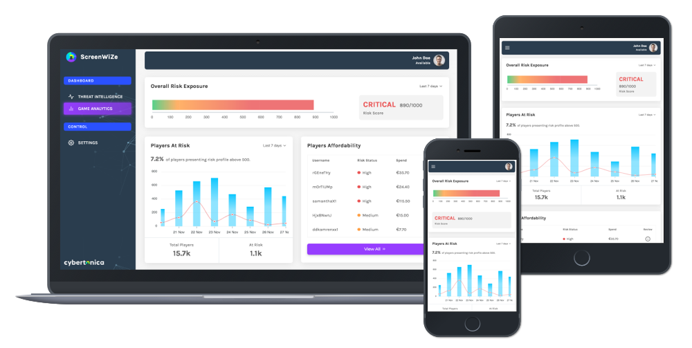
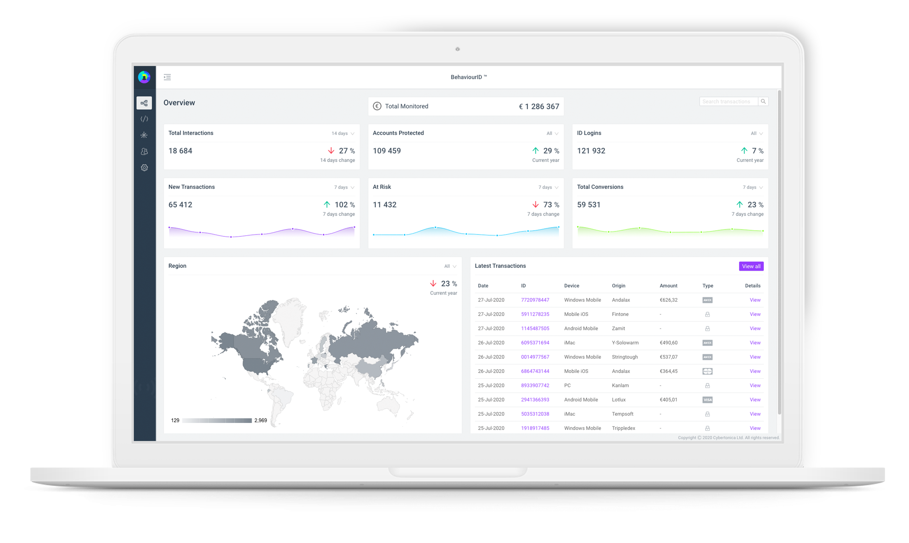
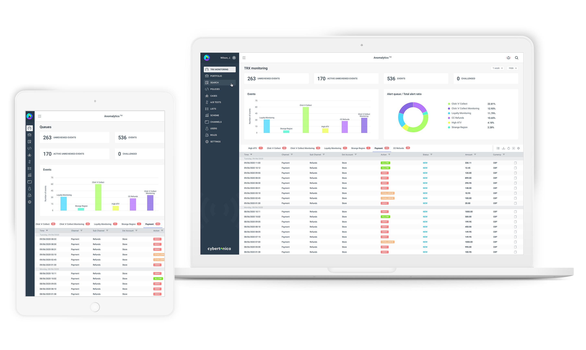
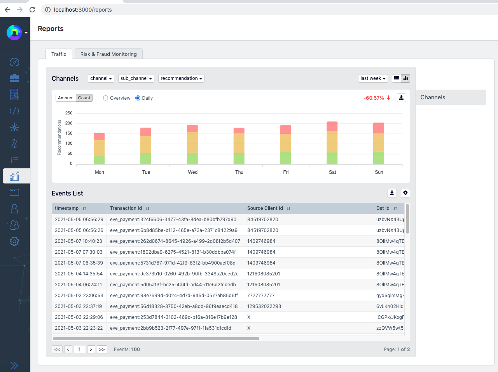
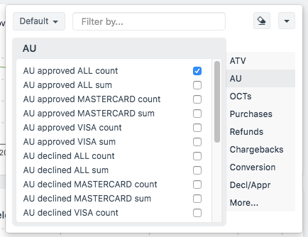
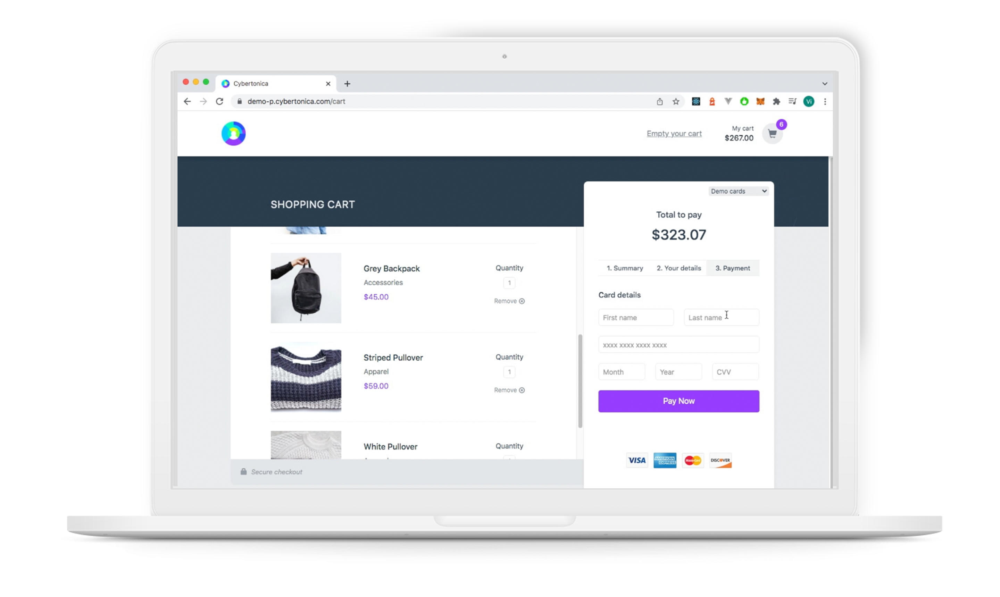
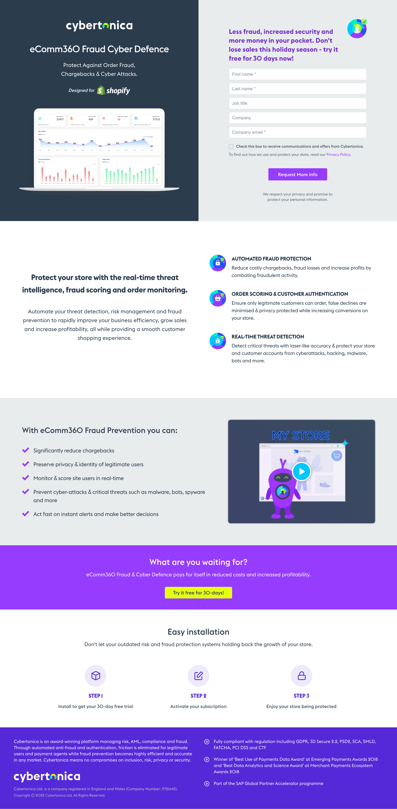
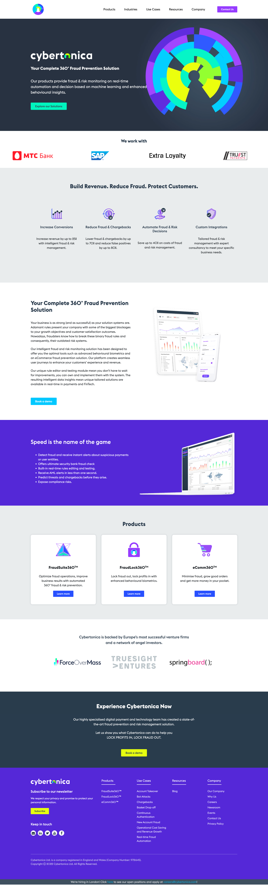
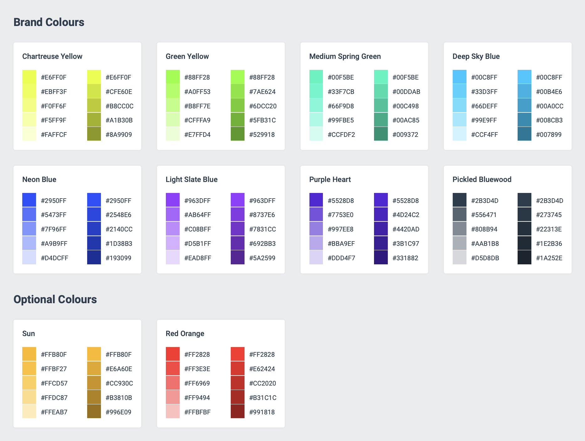
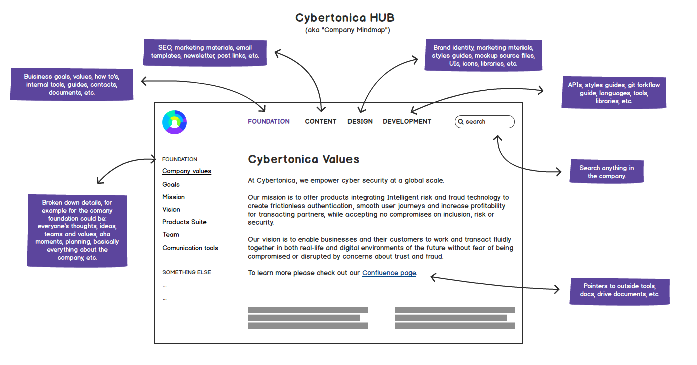

# Previous Job Projects

This repository contains screenshots and preview links for the projects I've been working on at Cybertonica Ltd.

## ScreenWize

- Created wireframes
- Created high-fidelity designs
- Built app using React and Next.js framework

[Live Preview](https://radiant-cannoli-cb46c0.netlify.app/)

*(no login details required, just click Sign in)*

## BehaviourID

- Created wireframes
- Created high-fidelity designs
- Built app using React and Ant Design framework

[Live Preview](https://startling-tapioca-ac3cdb.netlify.app/)

*(no login details required, just click Sign in)*

## GoFrictionless

- Created wireframes
- Created high-fidelity designs
- Built components using React for KPIs, charts, table sections

[Video Preview](https://magenta-eclair-160f87.netlify.app/trx_monitoring.mp4)

## Reporting Module

- Created wireframes
- Built a new app module using React and Bootstrap

[Video Preview](https://magenta-eclair-160f87.netlify.app/reporting_module.mp4)

## Filter Dropdown

- Created wireframes
- Built the component using React

[Video Preview](https://magenta-eclair-160f87.netlify.app/portfolio.mp4)

## Demo Shop

- Re-designed old shop
- Built app using React

[Video Preview (Before)](https://magenta-eclair-160f87.netlify.app/before_demo-p.mp4)

[Video Preview (After)](https://magenta-eclair-160f87.netlify.app/after_demo-p.mp4)

## Landing pages

- Created vector design assets
- Created wireframes
- Built landing pages using React and Gatsby
- Optimised on-page SEO

[Live Preview (Discover)](https://discover.cybertonica.com/)

[Live Preview (Option 1)](https://discover.cybertonica.com/ecomm360-fraud-cyber-defence/)

[Live Preview (Option 2)](https://discover.cybertonica.com/ecomm360-fraud-cyber-defence-for-shopify/)

[Live Preview (Option 3)](https://discover.cybertonica.com/ecomm360-fraud-prevention/)

[Live Preview (Option 4)](https://discover.cybertonica.com/ecomm360-fraud-prevention-for-shopify/)

[Live Preview (Option 5)](https://discover.cybertonica.com/fraud-cyber-defence-ecomm360/)

[Live Preview (Option 6)](https://discover.cybertonica.com/fraud-cyber-defence-ecomm360-for-shopify/)

[Live Preview (Option 7)](https://discover.cybertonica.com/fraud-prevention-ecomm360/)

[Live Preview (Option 8)](https://discover.cybertonica.com/fraud-prevention-ecomm360-for-shopify/)

[Live Preview (Option 9)](https://discover.cybertonica.com/thank-you/)

## Website

- Created vector design assets
- Build a custom WordPress theme
- Set up a website on the server
- Integrated staging/live system

[Live Preview](https://cybertonica.com/)

## Brand Colours

- Created a colour palette guide pdf document

## Company Hub

- Created wireframes

